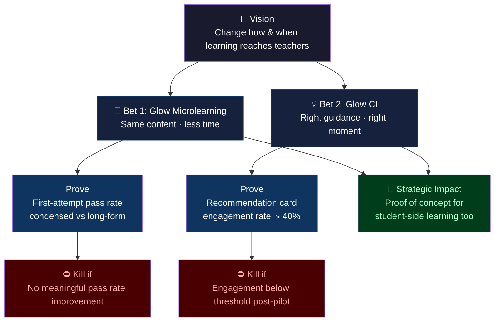

# Glow — Strategic Direction
March 2026 | Jasmine Tay | For Internal DXD view only

---

---

## Vision

Glow exists to make professional learning work better for teachers — not by adding more content, but by changing how and when it reaches them.

---

## The Problem

Current professional learning for teachers fails on two fronts:

- **Format:** Learning materials are long-form and text-heavy, requiring significant time and effort to extract actionable insight
- **Timing:** Learning is decoupled from practice — requires active discovery rather than at the moment teachers actually need it
- **Result:** Low retention, low application, and a growing sense that professional development doesn't translate to the classroom

---

## Our Strategic Bets

### Bet 1 — Glow Microlearning Platform
*The same content, in a fraction of the time*

Glow takes existing materials and uses AI to transform them into bite-sized, audio-first learning experiences — accessible anywhere, on any device.

**Hypothesis:** Teachers can acquire the same knowledge from condensed formats as from long-form materials, with higher retention and lower time cost.

**How we prove it:** Run mandatory modules as a controlled experiment — measure first-attempt pass rates between teachers who completed the condensed Glow format vs the traditional long-form version. A higher pass rate in the condensed group validates both the format and the AI transformation approach. This proof point also carries strategic value beyond teachers: it makes the case for microlearning in student-facing contexts too.

**Signal metric:** First-attempt pass rate (condensed vs long-form)

---

### Bet 2 — Glow Contextual Intelligence (CI)
*The right guidance, exactly when it's needed*

Glow CI is embedded directly in Teacher's Workspace. It reads the context of what a teacher is working on and proactively surfaces relevant guidance — summarised, cited, and ready to act on — without the teacher having to search for it.

**Hypothesis:** Learning delivered at the moment of need drives meaningfully higher engagement than learning delivered out of context.

**How we prove it:** Track engagement on surfaced recommendation cards and AI chat sessions in Teacher's Workspace.

**Signal metric:** Recommendation card engagement rate (target: >40%)

---

## How the 2 Bets Fit Together

Glow Microlearning addresses the format problem (too long, too dense). Glow CI addresses the timing problem (too late, too disconnected from practice). Together, they make a complete case for a new model of teacher learning — one that is faster to consume and better timed to land.

---

## Kill Decision

We stop investing in a bet if its core hypothesis fails to hold:

- **Bet 1 (Microlearning):** Kill if the mandatory module experiment shows no meaningful improvement in first-attempt pass rates for the condensed format over long-form
- **Bet 2 (Glow CI):** Kill if recommendation card engagement remains below a meaningful threshold after a sustained period post-pilot

---

## Strategic Impact

If either or both bets are successful, we prove our point about learning - making it fun, condensed, and delivered well results in better learning outcomes. These strategies can be translated to student learning space as well.

---

## Horizon

| Milestone | Date |
|---|---|
| Glow CI pilot launch | Aug 2026 |
| Glow CI general availability | Oct 2026 |
| Mandatory module experiment (Microlearning proof point) | June 2026 |
